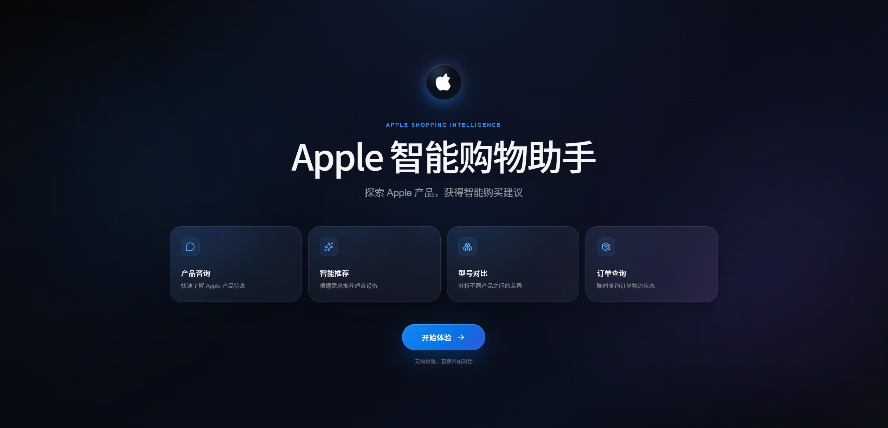
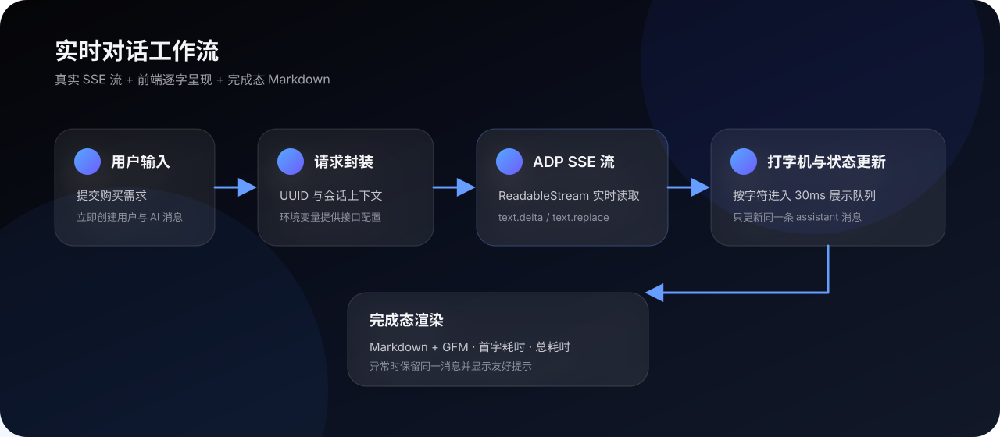

<div align="center">

# Apple 智能购物助手

基于 React 与腾讯云 ADP 的流式 AI 购物顾问 Demo

`React 19` · `Vite 8` · `JavaScript` · `HTTP SSE` · `Framer Motion`

</div>

> 这是一个个人作品集项目，用于展示 AI 产品前端、流式交互与视觉设计能力。项目与 Apple Inc.、腾讯云或其关联公司不存在官方隶属或背书关系。

## 产品预览

### 欢迎页

首次进入展示克制的暗色空间背景、产品能力卡片和无刷新入口。



### 智能聊天页

聊天页将产品咨询、智能推荐、型号对比、订单与退款场景统一收敛到自然语言入口，由智能体自动识别意图。


## 访客一分钟了解项目

| 维度 | 实现 |
| --- | --- |
| 产品体验 | 欢迎页进入、暗色玻璃拟态、响应式布局、鼠标环境光 |
| AI 对话 | 腾讯云 ADP 智能体、会话 ID、连续对话 |
| 流式输出 | `ReadableStream` 按块读取，支持 `text.delta` 与 `text.replace` |
| 文字呈现 | SSE 内容进入前端打字机队列，以约 30ms 间隔逐字展示 |
| 内容渲染 | 流式阶段使用纯文本，完成后使用 Markdown + GFM |
| 可观测性 | 独立展示首字响应耗时与总响应耗时 |
| 稳定性 | loading、无内容、HTTP 错误和网络异常处理 |

## 对话工作流



1. 用户提交问题后，页面立即插入用户消息和一条 `thinking` 状态的 AI 消息。
2. `api/agent.js` 生成请求标识并通过 `fetch` 发起 POST 请求。
3. `response.body.getReader()` 持续读取 SSE；完整事件一到达便解析 `text.delta` 或 `text.replace`。
4. 文本进入打字机队列，React 始终更新同一条 AI 消息，避免生成重复气泡。
5. SSE 完成并清空队列后，消息切换为 `completed`，再交给 Markdown 渲染，同时展示耗时。

## 核心设计取舍

- **真实流与视觉节奏分离**：网络层尽快接收数据，展示层通过字符队列保持稳定、可读的输出节奏。
- **流式阶段不解析 Markdown**：减少每个 chunk 触发 Markdown 重解析带来的闪烁和额外开销。
- **增量与替换事件兼容**：既支持 `text.delta` 追加，也支持 `text.replace` 全量替换。
- **单一消息状态机**：`thinking → streaming → completed / error`，让 loading、正文与异常状态互不混杂。
- **会话连续性**：组件生命周期内复用 `ConversationId`，支持多轮上下文。

## 技术栈

- React 19、Vite 8、JavaScript
- Framer Motion、Lucide React
- React Markdown、Remark GFM
- Fetch API、ReadableStream、HTTP SSE

## 项目结构

```text
src/
├─ api/
│  └─ agent.js            # 请求封装、ReadableStream 与 SSE 解析
├─ components/
│  ├─ WelcomeScreen.jsx   # 首次进入欢迎页
│  ├─ ChatBox.jsx         # 消息、状态和 Markdown 展示
│  ├─ InputBox.jsx        # 输入与发送交互
│  └─ Sidebar.jsx         # 能力提示区
├─ utils/
│  ├─ typewriter.js       # 逐字展示队列
│  ├─ uuid.js             # 请求与会话标识
│  └─ time.js             # 首字与总耗时计算
├─ App.jsx                # 页面切换与聊天流程编排
└─ index.css              # 全局视觉基础
```

## 本地运行

```bash
npm install
cp .env.example .env
npm run dev
```

Windows PowerShell：

```powershell
Copy-Item .env.example .env
npm.cmd install
npm.cmd run dev
```

随后打开 Vite 输出的地址，通常为 `http://localhost:5173/`。

## 环境变量

复制 `.env.example` 为 `.env`，再填入自己的智能体配置：

```env
VITE_AGENT_API_URL=https://your-agent-endpoint.example.com/chat
VITE_AGENT_APP_KEY=your_agent_app_key
VITE_AGENT_VISITOR_ID=your_visitor_id
```

真实 `.env` 已被 `.gitignore` 排除，不会提交到仓库。

## 可用命令

```bash
npm run dev      # 启动开发服务器
npm run build    # 构建生产版本
npm run preview  # 本地预览生产构建
npm run lint     # 运行 ESLint
```

## 安全与部署说明

这是一个纯前端演示项目。Vite 中以 `VITE_` 开头的变量会进入浏览器构建产物，因此长期有效的高权限凭据不应直接用于公开生产环境。正式部署时建议增加自有后端代理，在服务端保存凭据，并配置访问控制、限流和密钥轮换。

仓库仅包含占位配置；真实 AppKey、访客标识、日志、构建产物和本地依赖均不会上传。

## 版权

Copyright © 2026 Yangniannong. All rights reserved.

本项目仅用于个人作品集展示。未经明确书面许可，不得复制、再发布、出售或用于商业用途。详见 [LICENSE](./LICENSE)。
